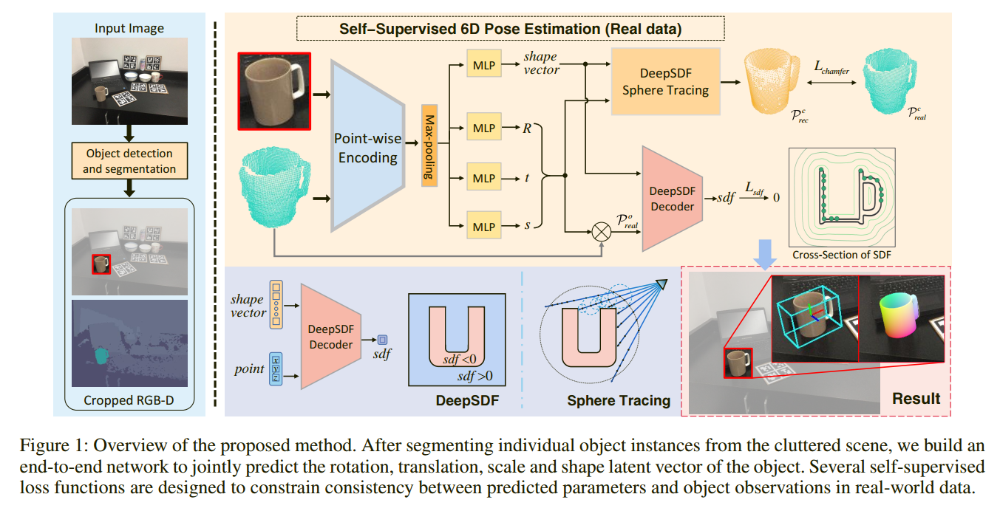

# Self-Supervised Category-Level 6D Object Pose Estimation with Deep Implicit Shape Representation (AAAI 2022)
This is the implementation of  [Self-Supervised Category-Level 6D Object Pose Estimation with Deep Implicit Shape Representation ](https://www.aaai.org/AAAI22Papers/AAAI-3056.PengW.pdf) published on AAAI 2022.



### Requirements
* Python 3.8
* PyTorch 1.7.0
* cudatookit 10.2
* Pytorch3D 0.3.0

Dependencies can also be easily installed using our [off-the-shelf environment](https://drive.google.com/file/d/17z1U9kP_Vu1yVpHb_JGedINDNVsQOTka/view?usp=sharing) based on [Anaconda](https://www.anaconda.com/).


### Data
- Download [camera_train](http://download.cs.stanford.edu/orion/nocs/camera_train.zip), [camera_val](http://download.cs.stanford.edu/orion/nocs/camera_val25K.zip), [real_train](http://download.cs.stanford.edu/orion/nocs/real_train.zip), [real_test](http://download.cs.stanford.edu/orion/nocs/real_test.zip), and [mesh models](http://download.cs.stanford.edu/orion/nocs/obj_models.zip) provided by [NOCS](https://github.com/hughw19/NOCS_CVPR2019).

- Download the segmentation results from Mask R-CNN and predictions of NOCS from [here](https://drive.google.com/file/d/1p72NdY4Bie_sra9U8zoUNI4fTrQZdbnc/view?usp=sharing) provided by [Object-DeformNet](https://github.com/mentian/object-deformnet).

- The directories should be arranged like the following folder structure:
```
data
├── CAMERA
│   ├── train
│   └── val
├── Real
│   ├── train
│   └── test
├── results
│   ├── mrcnn_results
│   ├── real
│   └── nocs_results
└── obj_models
    ├── train
    ├── val
    ├── real_train
    └── real_test
```

- Run the following command to preprocess data, which will last very long.

```bash
sh ./preprocess/preprocess.sh
```

## Evaluation
We provide the pretrained models for all the categories. We train the prediction network for each category separately so that the estimated poses and shapes do not interfere with each other among different classes. We use the average result from 6 repeated experiments as the final result in our paper for the preciseness of the experimental results. You can download the models for the DeepSDF decoder from [here](https://drive.google.com/file/d/17z1U9kP_Vu1yVpHb_JGedINDNVsQOTka/view?usp=sharing) and all the models of pose and shape encoder from [here](https://drive.google.com/file/d/17z1U9kP_Vu1yVpHb_JGedINDNVsQOTka/view?usp=sharing). 

For reproducibility, you should **evaluate all the 36 models and then take an average**.

To evaluate one category, e.g. laptop, just run the following command:
```
python eval/eval_6D_ICP.py \
             --category laptop   \
             --estimator_model models/trained_models/laptop/a_v1.1/pose_model_13_dis_real_0.028434450540386583.pth \
             --model_name a_v1.1
```

## Training
1. Train [DeepSDF](https://github.com/facebookresearch/DeepSDF) decoder using the CAD models. We provide pre-trained models from [here](https://drive.google.com/file/d/17z1U9kP_Vu1yVpHb_JGedINDNVsQOTka/view?usp=sharing). Note that we remove the models with excessively strange shapes that can’t exist in the real world beforehand. The removed models are listed in `lib/data/removed_models/`. 

2. Pre-train the model only using synthetic data. You should set the corresponding parameters from `./script/pre_train.sh` and simply run:
```
sh ./script/pre_train.sh
```

3. Train the model in the real dataset in a self-supervised way. You should set the corresponding parameters from `./script/train.sh` and simply run:
```
sh ./script/train.sh
```

You can download the pretrained and trained models from [here](https://drive.google.com/file/d/17z1U9kP_Vu1yVpHb_JGedINDNVsQOTka/view?usp=sharing). 

## Note
It should be noted that there is a small mistake in the original evaluation source code of NOCS, thus we revised it and recalculated all the metrics. The evaluation
source code after revision is given in our released code. The revised code is [here](https://github.com/swords123/SSC-6D/blob/4896efd4777c0a36e68ee6ea985f322375c58a38/eval/utils.py#L115)


## Acknowledgment
This repo is built based on [Object-DeformNet](https://github.com/hughw19/NOCS_CVPR2019), [Densefusion](https://github.com/j96w/DenseFusion), [DeepSDF](https://github.com/facebookresearch/DeepSDF) and [DIST](https://github.com/B1ueber2y/DIST-Renderer).

## Citation
If you find this work useful in your research, please consider citing our paper:
```
TODO
```

## License
Our code is released under [MIT license](LICENSE).


